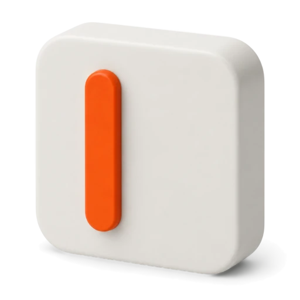
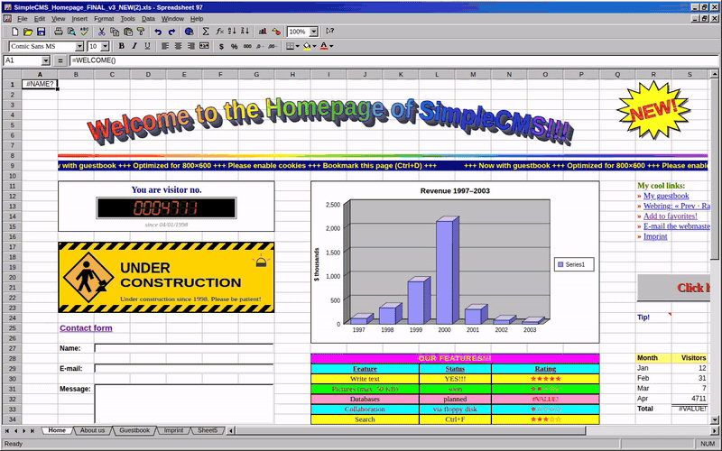
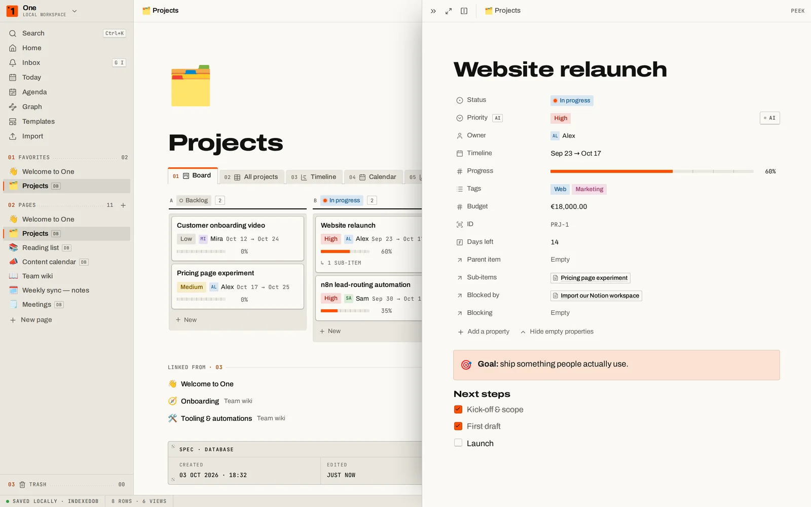
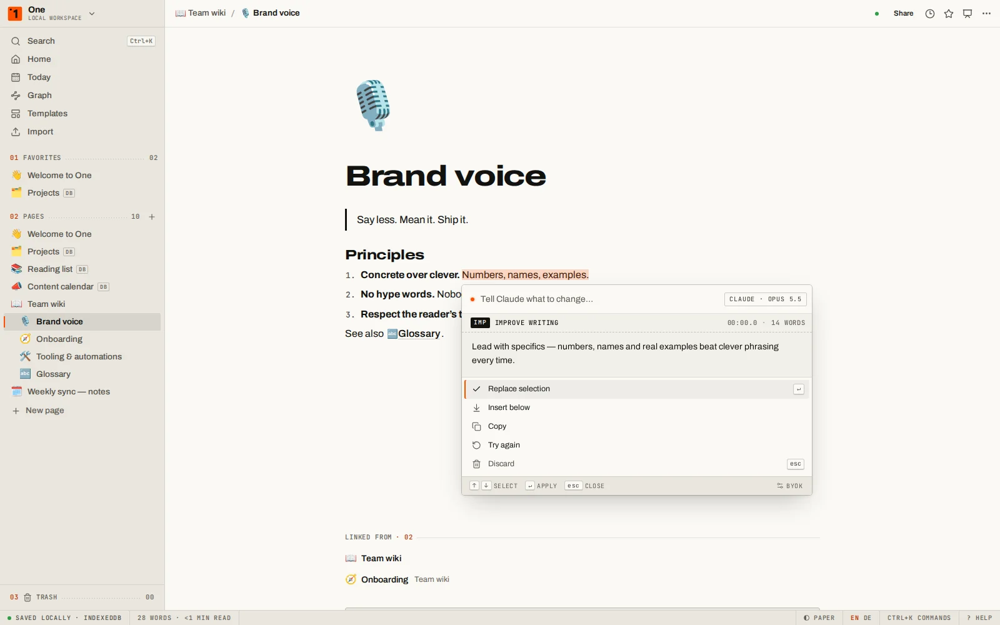
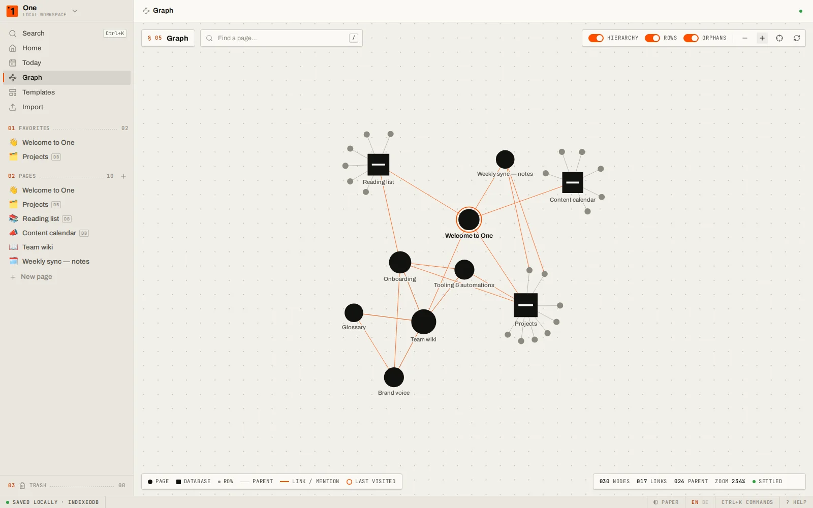
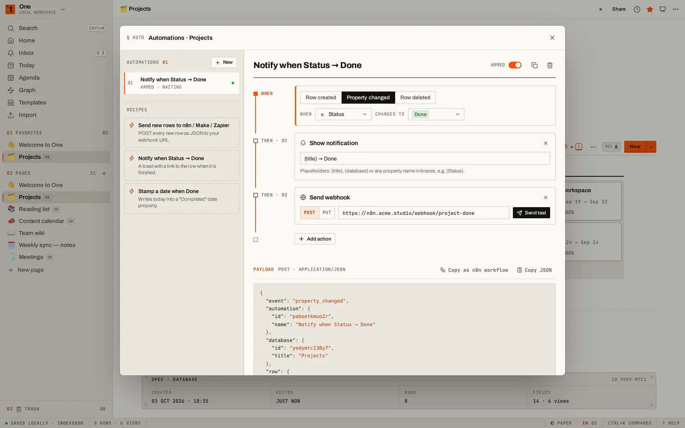
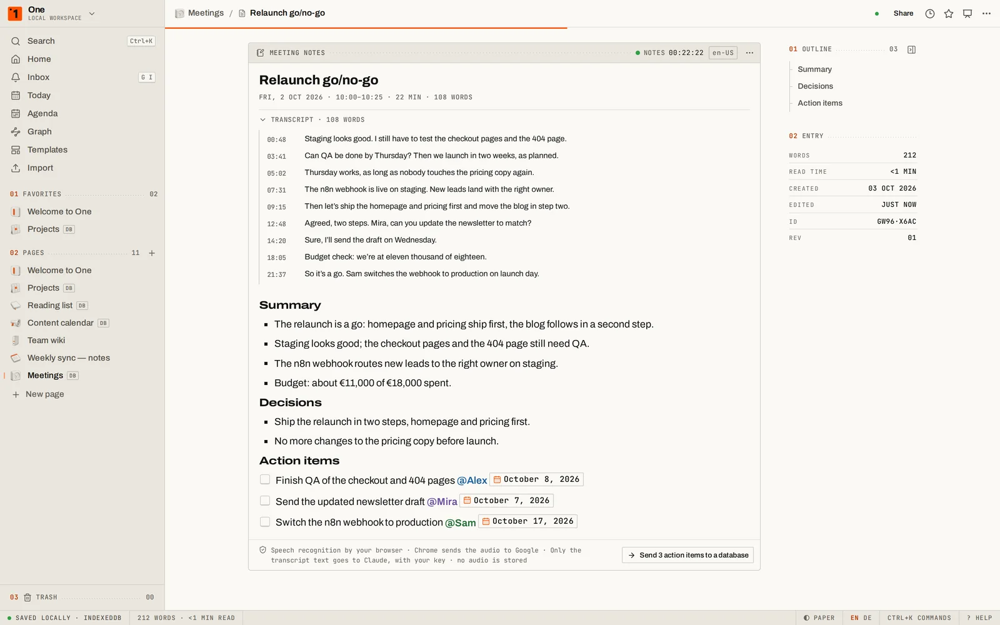
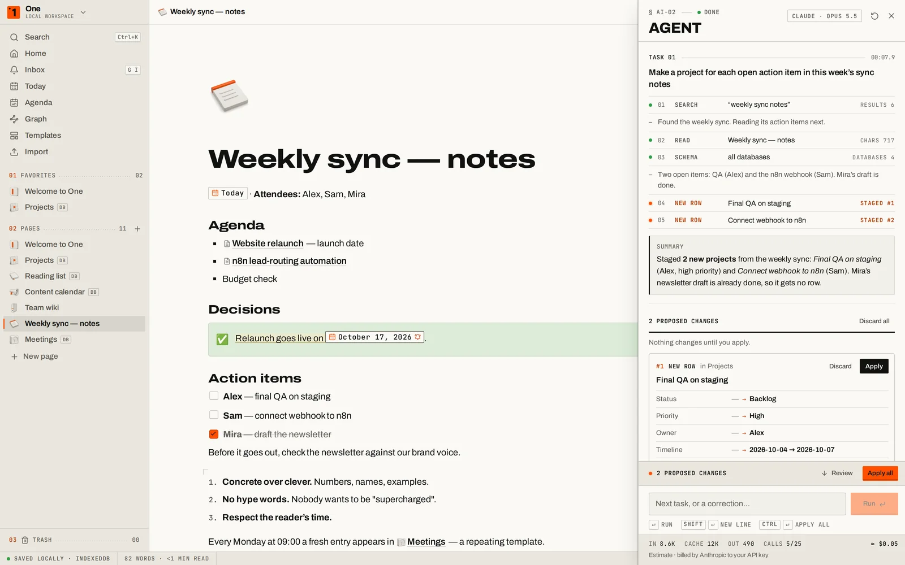
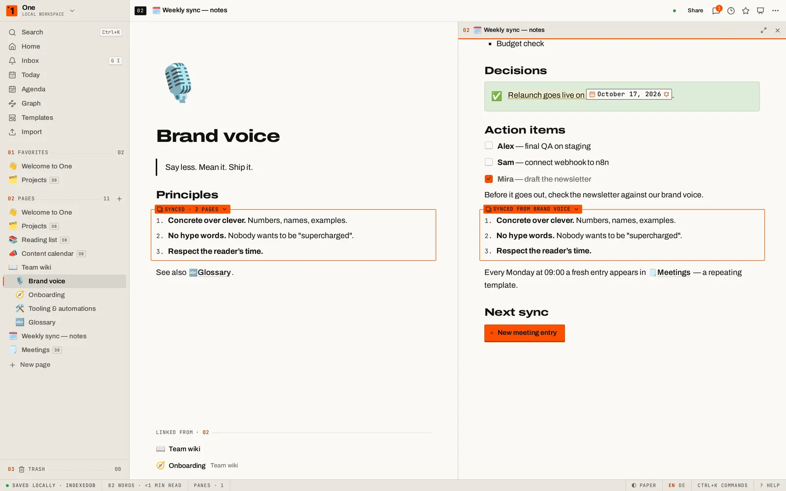
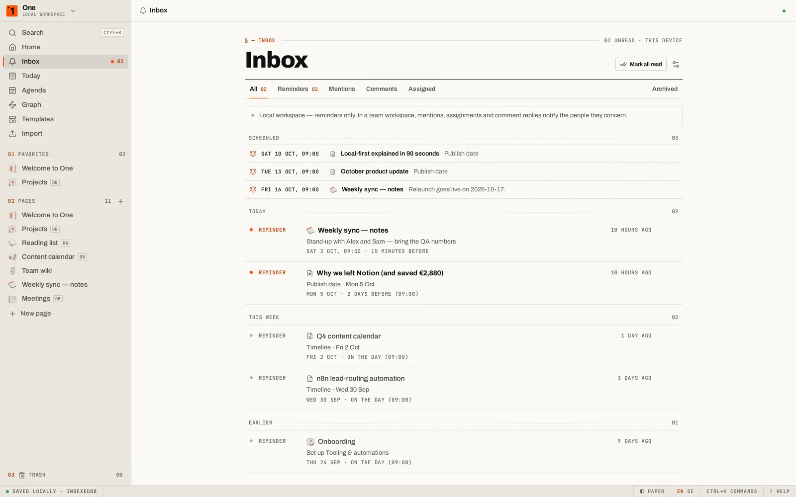

<div align="center">



# SimpleCMS One

**Notion, rebuilt. Minus the bill.**

A local-first workspace that does what Notion does — block editor, databases with eight views, forms,
Claude AI with your own key, webhook automations, import from Notion, Obsidian, Evernote and Trello,
publishing as a website — for **$0**, with **no account** and **no server**. Everything lives in your browser.

**[Live demo → getonecms.com](https://getonecms.com/)** ·
[Open the workspace](https://getonecms.com/app/) ·
[Deutsch ↓](#auf-deutsch)



<sub>First visit only: sit still for 15 seconds on the 1997 spreadsheet homepage. Replay any time with <code>?intro</code>.</sub>

**[▶ 60-second tour (video)](https://getonecms.com/media/simplecms-one.mp4)**

</div>

---

## Why

Notion is excellent — and it costs **$10–12 per seat per month on Plus**, and **$20–24 on Business**, the cheapest plan
with full Notion AI (notion.com/pricing, October 2026). A ten-person team on Business pays **$2,400 a year**, before
add-ons. Most of that money buys pages, blocks and databases that a modern browser can run on its own.

**One** is a faithful, keyboard-first rebuild of the parts people actually use, plus the things they keep asking
Notion for: a real offline mode, a graph, version history with no day limit, free webhooks for n8n / Make / Zapier,
AI on every workspace with your own Claude key, and an honest export.

| | Notion | **One** |
|---|---|---|
| Price | Free (limited) · Plus $10–12 · Business $20–24 per seat/month | **Free. No seats.** AI billed by Anthropic per use |
| Works fully offline, in the browser | partial (apps only, pages one by one) | **yes** — every page and row |
| Data stays on your device | no | **yes** — IndexedDB, no server |
| Use without an account | no | **yes** |
| Full AI on every plan | Business only | **yes** — bring your own Claude key |
| Webhook automations | paid plans | **free** on every database |
| Forms | yes | **free** — shared forms send answers to your n8n / Make / Zapier webhook |
| AI autofill for database columns | Business only | **yes** — with review before anything is written |
| Publish as a website | Notion Sites (custom domain extra) | **static site you own** — sitemap, RSS, `llms.txt`, Markdown twins |
| Import & export | many importers; export flattens views, relations and formulas | **Notion, Obsidian, Evernote, Trello, HTML, Markdown, CSV in — lossless JSON, Markdown, HTML, website out** |
| Calendar across all databases | separate app (Notion Calendar) | **Agenda** built in, plus `.ics` export |
| Graph view of linked pages | no | **yes** |
| Version history | 7 / 30 / 90 days by plan | **no limit**, block-level diff |
| Share without a server | no | **yes** — the page travels inside the link |
| Pages side by side | peek / second window | **stacked panes** |
| Real-time multiplayer | **yes** | **yes** in a team workspace on your own server (open source) — the local workspace stays single-user, synced across tabs |
| Inbox & reminders | yes | **yes** — reminders on any date; mentions, assignments and replies in team workspaces |
| Public API | yes | **yes** on a team server, plus an incoming webhook URL per database for n8n / Make / Zapier |
| MCP for AI agents | hosted connector | **yes** — local bridge to your open tab (approve each change), or the team server's `/mcp` endpoint |

<sub>Full research with sources: [docs/RESEARCH.md](docs/RESEARCH.md).</sub>

## What's inside

<table>
<tr>
<td width="50%"></td>
<td width="50%"></td>
</tr>
<tr>
<td></td>
<td></td>
</tr>
<tr>
<td></td>
<td></td>
</tr>
<tr>
<td></td>
<td></td>
</tr>
</table>

**Block editor** — slash menu (with the Markdown shortcut shown next to every command), drag handles, turn-into,
toggles and toggle headings, callouts, columns, tables, tabs, to-dos, code with highlighting, KaTeX math, Mermaid
diagrams, images, video & audio, files, embeds, bookmarks, table of contents, @-mentions of pages / dates (with
reminders) / people, emoji shortcodes, Markdown paste, block links, margin comments (they never leave the device),
**synced blocks** (the same content on several pages — edit it anywhere, it changes everywhere), **AI meeting notes**
(a live transcript from the browser's speech recognition, then summary, decisions and action items by Claude — action
items go straight into a database), and **buttons** that
insert blocks, add rows, edit properties, open links or fire a webhook in one click.

**Databases** — table, board, list, gallery, calendar, timeline, chart and form views over the same rows; 22 property
types including relations, rollups, formulas (safe parser, no `eval`), status, unique IDs, ratings and created by /
last edited by; filters with AND/OR groups and a "Me" filter, multi-sort, grouping, footer calculations, colour rules,
sub-items, timeline dependencies (with automatic shifting), row templates — also repeating ones (a fresh meeting entry
every Monday at 09:00) — locked databases, inline databases inside pages, side/centre peek, `.ics` calendar export, and
**AI autofill** — summaries, key info, translations or categories per row, reviewed before they are written. Forms
have conditional questions, several pages, scales and checkbox lists, a closing screen and a response summary.

**Workspace** — page tree with drag & drop, favourites, trash, breadcrumbs, `⌘K` palette for search *and* commands,
home dashboard, today's journal, an **Inbox** with reminders (and, in team workspaces, mentions, assignments and
replies), an **Agenda** with everything dated in the workspace (month, week, list), backlinks
and unlinked mentions, a web clipper (bookmarklet and Android share target) that saves to a Clippings page, stacked panes
(`Alt`-click any link), focus mode, presentation mode (any page becomes slides), 11 templates (meeting notes, project tracker, roadmap, content calendar, reading list, CRM, bug tracker,
OKRs, weekly planner, wiki, habits), light "Paper" and dark "Carbon" themes, English and German.

**AI, your key** — select text and ask Claude to improve, shorten, extend, fix, translate, explain, summarise or pull
out action items; press `Space` on an empty line to write, or ask questions about your whole workspace with cited
pages. The **workspace agent** (`⌘J` / `Ctrl+J`) takes a task in plain words — "tag every open task in the meeting
notes", "make a project row for each item on this page" — plans the steps across pages and databases and applies
them only after you have reviewed the changes. Requests go straight from your browser to `api.anthropic.com` with your key (default model Claude Opus 5.5;
Sonnet 5.5 and Haiku 4.5 selectable). The key never leaves this browser in any other way.

**Automations for automators** — every database can fire webhooks when rows are created, changed or deleted, set
properties, or show notifications; buttons and shared forms post to webhooks too. Ready-made recipes for n8n / Make /
Zapier. Every delivery carries a `deliveryId`, so receivers can drop the rare duplicate when a browser has to retry
without CORS. Payload:

```json
{
  "event": "row_created",
  "automation": { "id": "…", "name": "New row → Webhook" },
  "database": { "id": "…", "title": "Projects" },
  "row": {
    "id": "…",
    "title": "Website relaunch",
    "url": "https://getonecms.com/app/#/p/…",
    "properties": { "Status": "In progress", "Owner": "Alex" }
  },
  "changes": [{ "property": "Status", "from": "Backlog", "to": "In progress" }],
  "timestamp": "2026-10-03T09:41:07.000Z",
  "deliveryId": "V1StGXR8_Z5jdHi6B-myT",
  "source": "simplecms-one"
}
```

**Move in, move out** — import a Notion export (Markdown & CSV zip, nested pages, databases with typed columns,
images), an Obsidian vault (wikilinks, embeds, callouts), Evernote `.enex`, a Trello board, HTML pages, Markdown files,
CSV or a One backup. Export pages or the whole workspace as Markdown (zip), HTML, PDF or a lossless JSON backup —
or **publish it as a website**: a static site with navigation, sitemap, RSS, `llms.txt` and a Markdown twin of every
page, ready for GitHub Pages or Netlify. **Sync** keeps a live, readable copy of the workspace as Markdown files — in a
folder on your computer (Chrome / Edge) and/or in your own GitHub repository, one commit per push — and picks up
edits you make to those files outside One (conflicts are kept side by side, nothing is deleted without asking). Share read-only pages as links that *contain* the page (compressed into the
URL, optionally encrypted with a password) — no server involved.

**Teams, on your own server** — the same app also runs as a team workspace on a small server you host
(`server/`: Node, SQLite, Yjs, Docker + Caddy; licensed AGPL-3.0): sign-in by email link, roles (owner, admin, member,
viewer), invitations, live co-editing with cursors and presence, **private pages** (only you can open them — enforced
by the server, not just hidden), offline copies that sync when you are back, and a
**public REST API** with API tokens and an incoming webhook URL per database, so n8n, Make or Zapier can write rows
into One ([docs/API.md](docs/API.md)). Setup in [docs/SELF_HOSTING.md](docs/SELF_HOSTING.md), architecture in
[docs/CLOUD.md](docs/CLOUD.md). The local workspace keeps working without any of it.

**Agents & MCP** — One speaks the Model Context Protocol, so Claude Desktop, Claude Code or any MCP client can search,
read and write your workspace: pages, databases, rows and properties, with 13 tools. Locally, a small bridge
(`one-mcp.mjs`, one file) drives the One tab you have open — nothing leaves your computer, and changes wait for your
one-click approval unless you switch that off. A team server has a remote MCP endpoint (`/mcp`) that works with the
API tokens; a read token gets only the read tools. Setup and tool reference in [docs/MCP.md](docs/MCP.md).

**Private by construction** — no analytics, no cookies, no backend (unless you run the team server). A service worker keeps the app working offline
after the first visit. Several tabs stay in sync — when two of them edit the same page at the same moment, the
changes are merged (three-way, block by block and character by character), so nobody's words get lost.

## The intro

The first time you open the site you get the homepage of 1997: a spreadsheet with WordArt, a visitor counter, an
"under construction" sign and a default-colour 3D chart. Do nothing for 15 seconds and the window freezes
("Not Responding"), rumbles — and a procedurally modelled sledgehammer (Three.js, PBR steel, hickory handle) hits the
screen three times. The page is captured to a texture, fractured into Voronoi shards with real thickness, and falls
away while the new site assembles behind it. It plays once (`localStorage` key `one.introSeen`); `?intro` replays it,
`?skip` skips it, and reduced-motion / no-WebGL visitors get a graceful fallback.

## Run it

**Use it:** open the [live workspace](https://getonecms.com/app/). That's it.

**Self-host in two minutes:** fork this repository → *Settings → Pages → Source: GitHub Actions* → push to `main`.
The workflow in `.github/workflows/pages.yml` type-checks, builds and deploys; it reads the base path from your Pages
settings, so it works both as a project page (`you.github.io/<repo>/`) and on a custom domain.

**Develop:**

```bash
npm install
npm run dev          # landing at http://localhost:5173/ , app at /app/
npm run typecheck
npm run build:pages  # production build (BASE_PATH=/<repo>/ for a project page)
npm run test:e2e     # Playwright end-to-end suite (builds + previews automatically)
E2E_PORT=4190 npm run test:e2e   # a second suite in parallel: own port, own build folder
```

`node scripts/capture-shots.mjs` regenerates the landing-page screenshots from the real app. The promo video and the
challenge-post images are produced by the scripts in `scripts/promo/` (Playwright recordings, a synthesised soundtrack,
ffmpeg assembly; Python 3 with numpy + scipy).

## How it's built

- **Stack:** Vite, React 19, TypeScript, TipTap v3 (ProseMirror), Zustand + Immer, IndexedDB (`idb-keyval`), Three.js,
  GSAP, d3-force / d3-delaunay, KaTeX, Mermaid, fflate, the official Anthropic TypeScript SDK.
- **Structure:** `src/landing` (intro + site), `src/app/{store,shell,editor,database,features,ui}` — areas talk only
  through their public `index.ts`, the workspace store and a small UI store. See [CLAUDE.md](CLAUDE.md).
- **Design language "INSTRUMENT":** precision instruments, Braun, Teenage Engineering, Swiss manuals — warm paper,
  black ink and exactly one signal orange; Archivo with its width axis, JetBrains Mono labels, hairlines, keycaps and
  LEDs. No gradients, no glass, no glow.
- **Art:** the 3D icon set and page covers were generated with OpenArt (GPT Image 2.5 Sunburst for icons,
  Nano Banana Pro for covers), then art-directed, retouched and cut to transparent WebP — prompts and tooling in
  [docs/art](docs/art/PROMPTS.md). Fonts: Archivo, JetBrains Mono, Newsreader (SIL OFL).

Built for the **Ninja Armory** challenge of the AI Automations community.

## License

[MIT](LICENSE) © 2026 Marcel Weissgerber — use it, fork it, ship it. The team server in `server/` is licensed
[AGPL-3.0](server/LICENSE).

---

## Auf Deutsch

**SimpleCMS One** ist ein Workspace wie Notion, nur lokal, kostenlos und ohne Konto. Er bietet:

- einen Block-Editor mit Slash-Menü, Tabs, Randkommentaren und Buttons mit Aktionen
- Datenbanken mit acht Ansichten inklusive Formularen, Unterelementen, Abhängigkeiten und Farbregeln
- Claude-KI mit deinem eigenen API-Key, auch als KI-Autofill für Datenbank-Spalten
- Webhook-Automationen für n8n, Make und Zapier – auch aus Buttons und geteilten Formularen
- Import aus Notion, Obsidian, Evernote, Trello und HTML
- Veröffentlichen als statische Website, Teilen-Links ohne Server (optional mit Passwort)
- Agenda über alle Datenbanken, Web-Clipper, Graph-Ansicht und Versionsverlauf ohne Zeitlimit
- Posteingang mit Erinnerungen, synchronisierte Blöcke, Aufklapp-Überschriften, Video und Audio
- KI-Besprechungsnotizen: Live-Transkript, danach Zusammenfassung, Entscheidungen und Aufgaben per Claude
- Formulare mit bedingten Fragen, mehreren Seiten und Antwort-Übersicht
- Sync als Markdown in einen Ordner auf deinem Rechner oder dein eigenes GitHub-Repository – in beide Richtungen
- einen Workspace-Agenten (`⌘J`), der Aufgaben über Seiten und Datenbanken plant und erst nach deiner Prüfung ausführt
- MCP für KI-Agenten: Claude Desktop, Claude Code & Co. suchen, lesen und schreiben im Workspace – lokal über eine
  Brücke zu deinem offenen Tab (Änderungen nach deiner Freigabe), im Team über den `/mcp`-Endpunkt des Servers
  ([docs/MCP.md](docs/MCP.md))
- wiederkehrende Datenbank-Vorlagen, z. B. jeden Montag um 09:00 ein neuer Meeting-Eintrag
- Präsentationsmodus und Offline-Betrieb
- optional Team-Workspaces auf dem eigenen Server (Live-Zusammenarbeit, Rollen, Einladungen, private Seiten, öffentliche API und
  eingehende Webhooks) – Anleitung in [docs/SELF_HOSTING.md](docs/SELF_HOSTING.md)

Alles läuft im Browser, deine Daten verlassen dein Gerät nicht (außer du betreibst den Team-Server). Die Oberfläche gibt es auf Deutsch und Englisch und
erkennt die Sprache automatisch.

Beim ersten Besuch erscheint die Startseite von 1997 als hässliche Tabellenkalkulation. Wer 15 Sekunden nichts tut,
erlebt, wie ein 3D-Vorschlaghammer sie zertrümmert und die neue Seite darunter freilegt. Das passiert nur einmal;
mit `?intro` lässt es sich wiederholen.

**Loslegen:** [Workspace öffnen](https://getonecms.com/app/). Zum Selbst-Hosten: Repository
forken, *Settings → Pages → Source: GitHub Actions* einstellen und nach `main` pushen.

Lizenz: [MIT](LICENSE) — frei nutzen, forken, weitergeben. Der Team-Server in `server/` steht unter [AGPL-3.0](server/LICENSE).
