<div align="center">


# SimpleCMS One

**Notion, rebuilt. Minus the bill.**

A local-first workspace that does what Notion does — block editor, databases with nine views, forms,
spreadsheets, One Script, Gmail as a database, Claude AI with your own key (and it asks before it changes anything),
webhook automations, import from Notion, Obsidian, Evernote and Trello, publishing as a website — for **$0**, with
**no account** and **no server**. Everything lives in your browser.

**[Live demo → getonecms.com](https://getonecms.com/)** ·
[Open the workspace](https://getonecms.com/app/) ·
[Deutsch ↓](#auf-deutsch)


<sub>First visit only: sit still for 15 seconds on the 1997 spreadsheet homepage. Replay any time with <code>?intro</code>.</sub>

**[▶ 60-second tour (video)](https://getonecms.com/media/simplecms-one.mp4)**

</div>

---

## Why

Notion is excellent — and it costs **$10–12 per seat per month on Plus**, and **$20–24 on Business**, the cheapest plan
with full Notion AI (notion.com/pricing, October 2026). A ten-person team on Business pays **$2,400 a year**, before
add-ons. Most of that money buys pages, blocks and databases that a modern browser can run on its own.

**One** is a faithful, keyboard-first rebuild of the parts people actually use, plus the things they keep asking
Notion for: a real offline mode, a graph, version history with no day limit, free webhooks for n8n / Make / Zapier,
AI on every workspace with your own Claude key, and an honest export.

| | Notion | **One** |
|---|---|---|
| Price | Free (limited) · Plus $10–12 · Business $20–24 per seat/month | **Free. No seats.** AI billed by Anthropic per use |
| Works fully offline, in the browser | partial (apps only, pages one by one) | **yes** — every page and row |
| Data stays on your device | no | **yes** — IndexedDB, no server |
| Use without an account | no | **yes** |
| Full AI on every plan | Business only | **yes** — bring your own Claude key |
| Webhook automations | paid plans | **free** on every database |
| Forms | yes | **free** — shared forms send answers to your n8n / Make / Zapier webhook |
| AI autofill for database columns | Business only | **yes** — with review before anything is written |
| Publish as a website | Notion Sites (custom domain extra) | **static site you own** — sitemap, RSS, `llms.txt`, Markdown twins |
| Import & export | many importers; export flattens views, relations and formulas | **Notion, Obsidian, Evernote, Trello, HTML, Markdown, CSV in — lossless JSON, Markdown, HTML, website out** |
| Calendar across all databases | separate app (Notion Calendar) | **Agenda** built in, plus `.ics` export |
| Graph view of linked pages | no | **yes** |
| Version history | 7 / 30 / 90 days by plan | **no limit**, word-level diff — database entries with their property values |
| Share without a server | no | **yes** — the page travels inside the link |
| Pages side by side | peek / second window | **stacked panes** |
| Real-time multiplayer | **yes** | **yes** in a team workspace on your own server (open source) — the local workspace stays single-user, synced across tabs |
| Inbox & reminders | yes | **yes** — reminders on any date; mentions, assignments and replies in team workspaces |
| Public API | yes | **yes** on a team server, plus an incoming webhook URL per database for n8n / Make / Zapier |
| MCP for AI agents | hosted connector | **yes** — local bridge to your open tab (approve each change), or the team server's `/mcp` endpoint |

<sub>Full research with sources: [docs/RESEARCH.md](docs/RESEARCH.md).</sub>

## Claude asks before it changes

Every change Claude proposes lands on a review plate first: the AI terminal shows its edits word by word (struck
words, new words, removed blocks — apply one, apply all, discard), memories are kept only after your `y`, scripts show
a dry run of every write and every mail, and before Claude, an agent or a script writes, the version history keeps the
page as it was — text and property values.

<table>
<tr>
<td width="50%">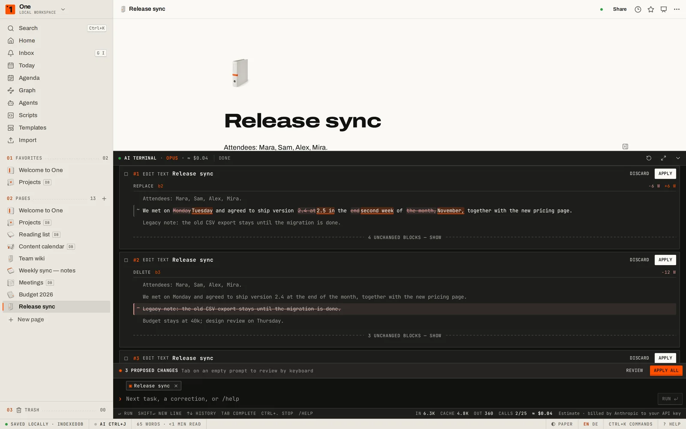</td>
<td width="50%">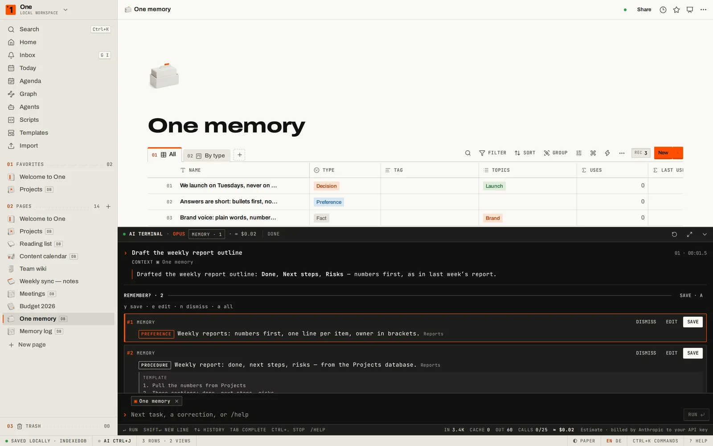</td>
</tr>
<tr>
<td>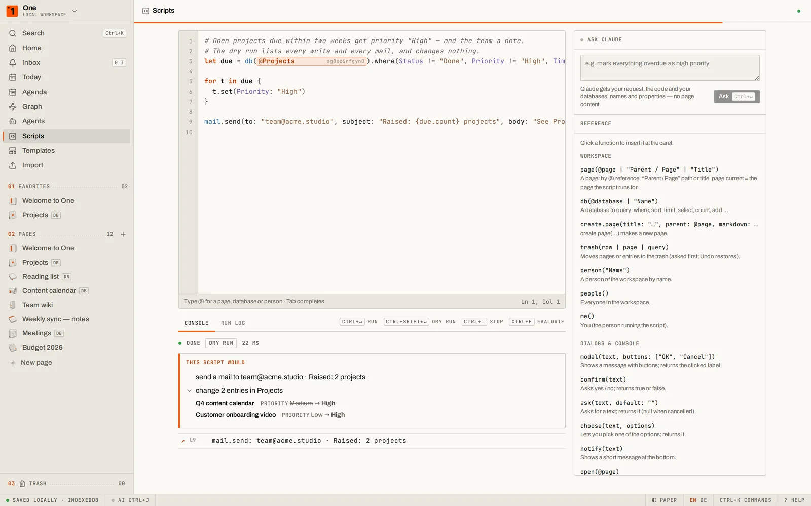</td>
<td>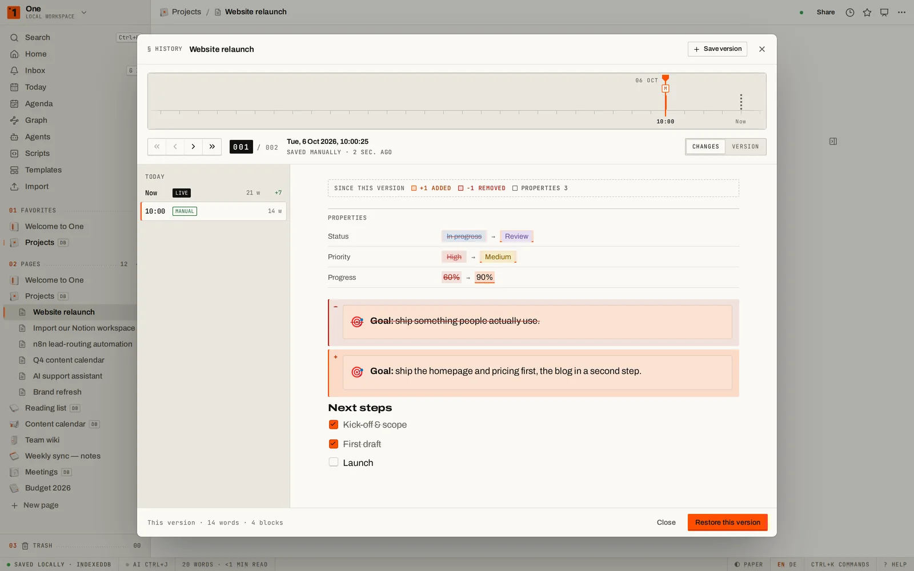</td>
</tr>
</table>

## What's inside

<table>
<tr>
<td width="50%">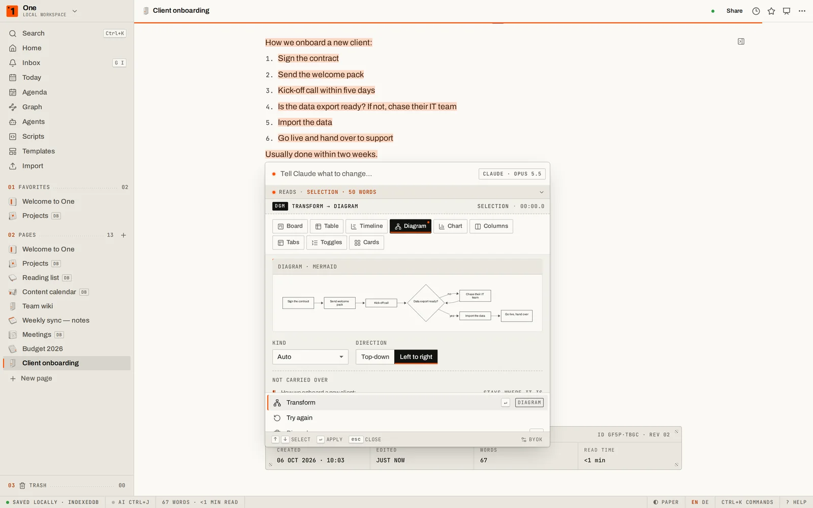</td>
<td width="50%">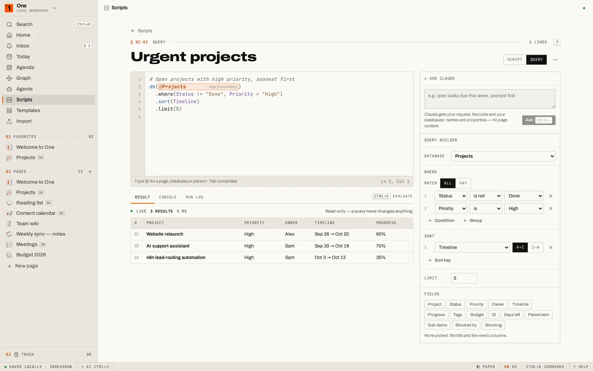</td>
</tr>
<tr>
<td>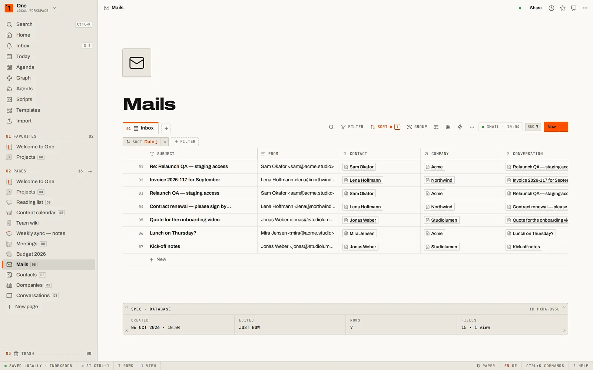</td>
<td>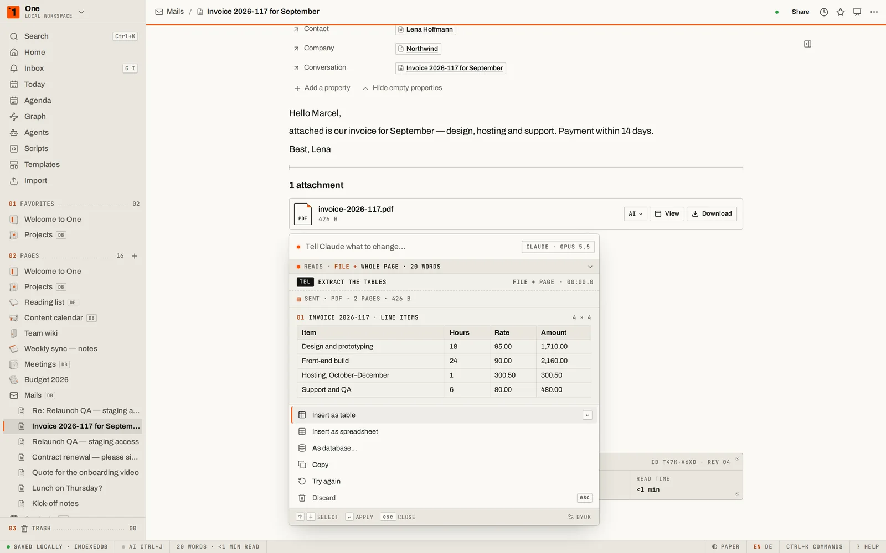</td>
</tr>
<tr>
<td>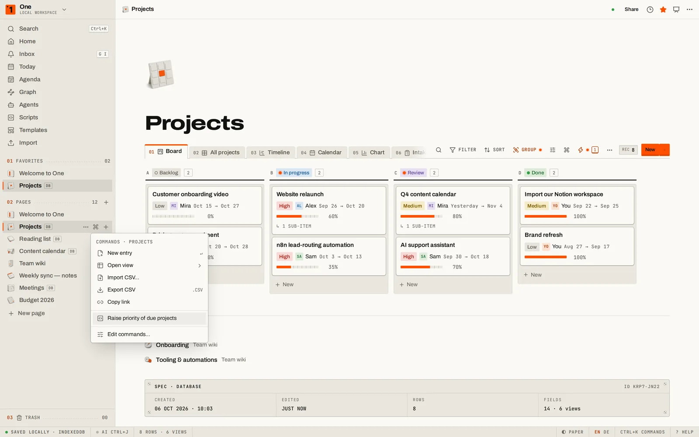</td>
<td></td>
</tr>
<tr>
<td></td>
<td>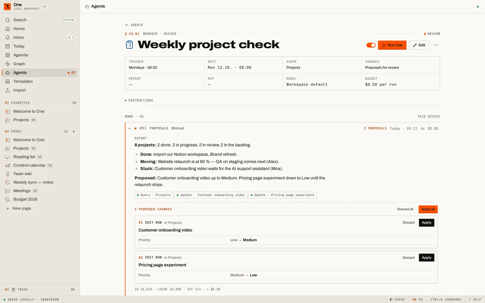</td>
</tr>
<tr>
<td></td>
<td></td>
</tr>
<tr>
<td></td>
<td>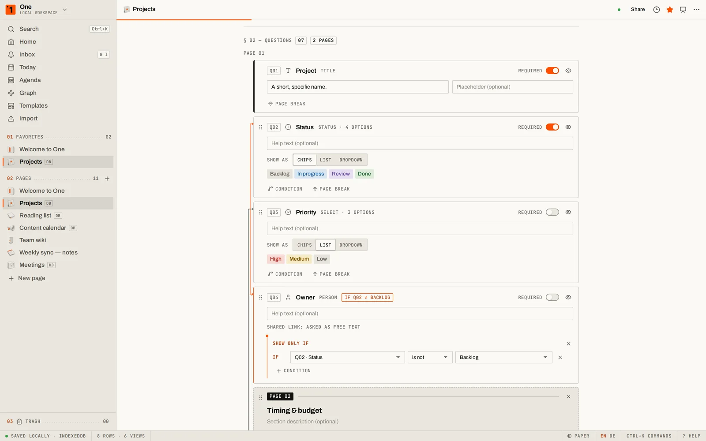</td>
</tr>
</table>

**Block editor** — slash menu (with the Markdown shortcut shown next to every command), drag handles in one gutter
column for every block at any depth (never on a list marker), many blocks selected at once and acted on in one step, turn-into,
toggles and toggle headings, callouts, 2–5 columns, tables, tabs, to-dos, code with highlighting, KaTeX math, Mermaid
diagrams, images, video & audio, files, PDFs shown inline, embeds (YouTube, Figma, Loom, Google Docs / Sheets / Slides /
Drive, Miro, Excalidraw, GitHub Gist, Spotify, Typeform, Calendly, Airtable, CodeSandbox, X and more — all in sandboxed
frames), bookmarks, breadcrumbs, links to existing pages, a one-step **/form** block, table of contents, @-mentions of pages / dates (with
reminders) / people, emoji shortcodes, Markdown paste, block links, margin comments (they never leave the device),
**synced blocks** (the same content on several pages — edit it anywhere, it changes everywhere), **AI meeting notes**
(a live transcript from the browser's speech recognition, then summary, decisions and action items by Claude — action
items go straight into a database), and **buttons** that
insert blocks, add rows, edit properties, open links, run a script or fire a webhook in one click.

**Databases** — table, board, list, gallery, **feed** (a stream of posts with their content), calendar, timeline,
chart and form views over the same rows; 22 property
types including relations, rollups, formulas (safe parser, no `eval`), status, unique IDs, ratings and created by /
last edited by; filters with AND/OR groups and a "Me" filter, multi-sort, grouping, footer calculations, colour rules,
sub-items, timeline dependencies (with automatic shifting), row templates — also repeating ones (a fresh meeting entry
every Monday at 09:00) — locked databases, inline databases inside pages, side/centre peek, `.ics` calendar export, and
**AI autofill** — summaries, key info, translations or categories per row, reviewed before they are written. Forms
have conditional questions, several pages, scales and checkbox lists, a closing screen and a response summary.
Missing properties are created on the fly — when you link a row of another database, type an unknown name into a
filter, sort or formula, or take in a CSV. Own templates sit next to the built-in ones (which you can customise too).
In the sidebar a database opens like a folder: its entries (in the order of its first view), their sub-items and
sub-pages; `+` adds an entry, and dragging a page onto a database makes it one. **Database commands:** every database
has a `⌘` key (on its sidebar row, in its toolbar, in `⌘K` as "Projects: …") with its commands — new entry, from a
template, open a view, CSV in and out, copy the link, Mails' "Sync now", "Run <agent> now" — and your own commands that
run a set of actions on the selected rows, an agent, a view or a One Script.

**Spreadsheets, functions, charts** — a spreadsheet block with several sheets, 75+ functions (SUM, VLOOKUP/XLOOKUP,
SUMIFS, dates, text, finance …), cross-sheet references, copy & paste with Excel / Sheets / Numbers, and **datasets**:
`DS(A1:A10; C2:C7)` bundles areas, each `DS(…)` gets its own colour in the grid while you edit, and named datasets stay
tinted. **Your own functions** are built by clicking a formula tree — parameters, a readable preview, a test bench —
and work in sheets and database formulas; there is no code anywhere, and the engine (no `eval`, step and depth limits)
can't be talked into running any. **Charts** take three clicks: data from a sheet, a database, the workspace's own
numbers (pages written, to-dos done, storage, reminders …) or typed in; bar, line, area, donut, scatter, KPI and
sparkline, live as the data changes, as PNG/SVG, and frozen into numbers when a page is shared.

**One Script** — a small language of its own for the workspace (`#/scripts`), interpreted by One itself — no `eval`,
no `new Function`, objects answer only their own members. A **query** shows its result as a live table while you type
(`db(@Projects).where(Status != "Done", Priority = "High").sort(Timeline)`), and a visual query builder writes the same
code by clicking (and follows the code you type); "Ask Claude" drafts a query from plain words, and One checks it before
you use it. **Scripts** change entries, create pages, send a mail or ask Claude — a **dry run** lists every write and
every mail and changes nothing, a real run asks once for its effects, keeps a version of every page before its first
change, and "Undo run" puts everything back. Scripts run from a database's `⌘` key, a button, an automation or `⌘K`;
the AI terminal can query with them and draft new ones (staged for review, never run by itself).

**Workspace** — page tree with drag & drop, favourites, trash, breadcrumbs, `⌘K` palette for search *and* commands,
home dashboard, today's journal, an **Inbox** with reminders (and, in team workspaces, mentions, assignments and
replies), an **Agenda** with everything dated in the workspace (month, week, list), backlinks
and unlinked mentions, a web clipper (bookmarklet and Android share target) that saves to a Clippings page, stacked panes
(`Alt`-click any link), focus mode, presentation mode (any page becomes slides), 11 templates (meeting notes, project tracker, roadmap, content calendar, reading list, CRM, bug tracker,
OKRs, weekly planner, wiki, habits), light "Paper" and dark "Carbon" themes, English and German — and a built-in
**help centre** (`?`): 57 short articles in both languages, searchable from `⌘K`, an "Ask the help" box that has Claude
answer from those articles only, and the same manual as public pages at [getonecms.com/help](https://getonecms.com/help/).

**AI, your key** — select text and ask Claude to improve, shorten, extend, fix, translate, explain, summarise or pull
out action items; press `Space` on an empty line to write, or ask questions about your whole workspace with cited
pages. The **AI terminal** (`⌘J` / `Ctrl+J`) — the workspace agent as a keyboard-first dock under the page — takes a
task in plain words — "tag every open task in the meeting notes", "make a board of the open items on this page" —
plans the steps across pages and databases (it can create databases and properties too) and applies them only after
you have reviewed the changes, by mouse or keyboard (`j`/`k`, `Space`, `Enter`). Edits to a page are shown **word by
word** — struck words, new words, removed and inserted blocks, unchanged blocks folded — and a version of the page is
kept before they land. It keeps working while hidden (a
status-bar LED and a toast report back), takes selected text along as references (`⌘⇧J`), `@` mentions, prompt
history and `/commands` (`/apply`, `/cost`, `/help` …). Requests go straight from your browser to `api.anthropic.com` with your key (default model Claude Opus 5.5;
Sonnet 5.5 and Haiku 4.5 selectable). The key never leaves this browser in any other way, and is stored there
encrypted — as is the GitHub token for sync ([docs/SECURITY.md](docs/SECURITY.md): how, and what that does and does not protect against).
**External tools via MCP:** add any remote MCP server — a knowledge base, a tracker, a CRM — with its URL and a token
(sealed in the same vault); One checks it, has Claude write an editable usage guide for it, and from then on the agent,
your own requests and `⌘K ?` can use its tools (Anthropic's MCP connector makes the calls; every call shows as a chip).
Give a server a codeword and a request that starts with it — `kb: what do we know about the launch?` — goes to that server first.

**Transform into …** — select a list or a few paragraphs and Claude turns them into a **diagram** (Mermaid, checked
before it is shown), a **chart** (only numbers the text states), a board, a table or a timeline, or columns, tabs,
toggles and cards (built by code, not HTML) — previewed first, applied in one step, the original kept below on request.
**Turn into database** — select a pasted report or list and Claude makes it a board or a table (entries, fields,
groups; previewed before anything changes, one `⌘Z` to undo) — inline, or as its own page linked in its place.
**Turn into page** (`⌘⌥9`, no AI) moves marked blocks into a new sub-page and links it right there; several selected
blocks keep a pinned grip, a count chip and one menu for all of them. AI-menu requests keep running in the background when
you close the panel or open another page — the page tells you when the result is ready.

**What Claude reads, what it redoes** — mark the blocks of a page Claude may read, or leave the page out entirely: the
AI menu and the AI terminal show it ("Reads · 3 marked blocks · 412 words") and keep to it; unmarked text is never sent.
Mark passages anywhere on a page and have Claude redo them with your instructions — saved presets, a style-guide page as
rules —, then accept or reject each one in a word-level review; everything accepted lands in one step, one `⌘Z` to undo.

**One memory** — Claude remembers what you confirm: after an AI-terminal task it proposes what is worth keeping
(`y` saves, `n` dismisses), `/remember …` or "remember …" in the AI menu add your own. The memory is a database in your
workspace (private in a team) — facts, preferences, decisions, procedures with their template, and whole pages saved as
**examples** with a tag: "take #wochenbericht as the template" builds new content on that example. The matching memories
go along with every free-form request as the template for the task; a usage log shows what was used, where and when.

**Claude for images** — the AI key on any image: alt text + caption written for it, the text in it read out as
Markdown, every table in the picture turned into a real table, a spreadsheet (numbers as numbers) or a database, or any
question answered about it — background runs like every AI-menu request; the picture goes out only on these actions.
**Claude for files** — the same key on any file block (an upload, a mail attachment): a PDF summarised, its text as a
page, its tables as a table, a spreadsheet or a database (a PDF goes to Claude as a document, counted and checked
before it is sent); Word, HTML, RTF and text files open as a page, CSV / TSV / Excel import as a database or a
spreadsheet — those conversions run right here, nothing is sent.

**Custom agents** — saved AI helpers for recurring work, like Notion's: a job in plain words, a trigger (a schedule, a
new or changed row — which covers form answers and synced mails —, by hand, or a webhook), what they may read and
write, external MCP tools, and a budget per run. They report back and, by default, stage their changes for your
review (or apply them directly, undoable in the version history; their edits show as "Agent · name"). They run in your
browser while One is open — missed runs catch up once — or, in a team workspace, **around the clock on your server**,
also when nobody is online.

**Mail as a database** — connect Gmail in one click with One's own Google access, or with your own Google client ID
(read-only scope, the access token only in memory): mails from a date you choose, by label, become rows of a "Mails"
database with sender, labels, link and the cleaned-up body (remote images and tracking pixels blocked). Senders,
their companies and threads fill linked Contacts, Companies and Conversations databases — names instead of addresses,
rename or merge once. Attachments load on demand (or automatically) as real blocks: PDFs in the viewer, images, files.
Turn on "organise with Claude" and each mail gets a category, priority, "needs reply" and a one-line summary — or let a
custom agent triage new mail every morning.

**Automations for automators** — every database can fire webhooks when rows are created, changed or deleted, set
properties, or show notifications; buttons and shared forms post to webhooks too. Ready-made recipes for n8n / Make /
Zapier. Every delivery carries a `deliveryId`, so receivers can drop the rare duplicate when a browser has to retry
without CORS. Payload:

```json
{
  "event": "row_created",
  "automation": { "id": "…", "name": "New row → Webhook" },
  "database": { "id": "…", "title": "Projects" },
  "row": {
    "id": "…",
    "title": "Website relaunch",
    "url": "https://getonecms.com/app/#/p/…",
    "properties": { "Status": "In progress", "Owner": "Alex" }
  },
  "changes": [{ "property": "Status", "from": "Backlog", "to": "In progress" }],
  "timestamp": "2026-10-03T09:41:07.000Z",
  "deliveryId": "V1StGXR8_Z5jdHi6B-myT",
  "source": "simplecms-one"
}
```

**Move in, move out** — import a Notion export (Markdown & CSV zip, nested pages, databases with typed columns,
images), an Obsidian vault (wikilinks, embeds, callouts), Evernote `.enex`, a Trello board, HTML pages, Markdown files,
CSV or a One backup. Export pages or the whole workspace as Markdown (zip), HTML, PDF or a lossless JSON backup —
or **publish it as a website**: a static site with navigation, sitemap, RSS, `llms.txt` and a Markdown twin of every
page, ready for GitHub Pages or Netlify. **Sync** keeps a live, readable copy of the workspace as Markdown files — in a
folder on your computer (Chrome / Edge) and/or in your own GitHub repository, one commit per push — and picks up
edits you make to those files outside One (conflicts are kept side by side, nothing is deleted without asking). Share read-only pages as links that *contain* the page (compressed into the
URL, optionally encrypted with a password) — no server involved.

**Teams, on your own server** — the same app also runs as a team workspace on a small server you host
(`server/`: Node, SQLite, Yjs, Docker + Caddy; licensed AGPL-3.0): sign-in by email link, roles (owner, admin, member,
viewer), invitations, live co-editing with cursors and presence, **private pages** (only you can open them — enforced
by the server, not just hidden), a personal space for every account from the first sign-in, content **encrypted at
rest** with a key per workspace, offline copies that sync when you are back, and a
**public REST API** with API tokens and an incoming webhook URL per database, so n8n, Make or Zapier can write rows
into One ([docs/API.md](docs/API.md)). Setup in [docs/SELF_HOSTING.md](docs/SELF_HOSTING.md), architecture in
[docs/CLOUD.md](docs/CLOUD.md). The local workspace keeps working without any of it.

**Agents & MCP** — One speaks the Model Context Protocol, so Claude Desktop, Claude Code or any MCP client can search,
read, write and tidy up your workspace — pages, databases, rows, properties and views: move, reshape, trash (a
database with its rows, up to 50 items at once) and restore, never deleted for good — with 23 tools. Start a message
with the codeword `one:` and Claude uses One for it. Locally, a small bridge
(`one-mcp.mjs`, one file — or **one click** as a Claude Desktop extension, `one.mcpb`) drives the One tabs you have
open — nothing leaves your computer, and changes wait for your one-click approval unless you switch that off. Several
workspaces can be connected at once (each in its tab); agents name the one they mean, and a call meant for one
workspace never runs in another. A team server has a remote MCP endpoint (`/mcp`) that works with the
API tokens; a read token gets only the read tools. Setup and tool reference in [docs/MCP.md](docs/MCP.md).

**Private by construction** — no analytics, no cookies, no backend (unless you run the team server). A service worker keeps the app working offline
after the first visit. Several tabs stay in sync — when two of them edit the same page at the same moment, the
changes are merged (three-way, block by block and character by character), so nobody's words get lost.

## The intro

The first time you open the site you get the homepage of 1997: a spreadsheet with WordArt, a visitor counter, an
"under construction" sign and a default-colour 3D chart. Do nothing for 15 seconds and the window freezes
("Not Responding"), rumbles — and a procedurally modelled sledgehammer (Three.js, PBR steel, hickory handle) hits the
screen three times. The page is captured to a texture, fractured into Voronoi shards with real thickness, and falls
away while the new site assembles behind it. It plays once (`localStorage` key `one.introSeen`); `?intro` replays it,
`?skip` skips it, and reduced-motion / no-WebGL visitors get a graceful fallback.

## Run it

**Use it:** open the [live workspace](https://getonecms.com/app/). That's it.

**Self-host in two minutes:** fork this repository → *Settings → Pages → Source: GitHub Actions* → push to `main`.
The workflow in `.github/workflows/pages.yml` type-checks, builds and deploys; it reads the base path from your Pages
settings, so it works both as a project page (`you.github.io/<repo>/`) and on a custom domain.

**Develop:**

```bash
npm install
npm run dev          # landing at http://localhost:5173/ , app at /app/
npm run typecheck
npm run build:pages  # production build (BASE_PATH=/<repo>/ for a project page)
npm run test:e2e     # Playwright end-to-end suite (builds + previews automatically)
E2E_PORT=4190 npm run test:e2e   # a second suite in parallel: own port, own build folder
```

`node scripts/capture-shots.mjs` regenerates the landing-page screenshots from the real app. The promo video and the
challenge-post images are produced by the scripts in `scripts/promo/` (Playwright recordings, a synthesised soundtrack,
ffmpeg assembly; Python 3 with numpy + scipy).

## How it's built

- **Stack:** Vite, React 19, TypeScript, TipTap v3 (ProseMirror), Zustand + Immer, IndexedDB (`idb-keyval`), Three.js,
  GSAP, d3-force / d3-delaunay, KaTeX, Mermaid, fflate, the official Anthropic TypeScript SDK.
- **Structure:** `src/landing` (intro + site), `src/app/{store,shell,editor,database,features,ui}` — areas talk only
  through their public `index.ts`, the workspace store and a small UI store. See [CLAUDE.md](CLAUDE.md).
- **Design language "INSTRUMENT":** precision instruments, Braun, Teenage Engineering, Swiss manuals — warm paper,
  black ink and exactly one signal orange; Archivo with its width axis, JetBrains Mono labels, hairlines, keycaps and
  LEDs. No gradients, no glass, no glow.
- **Art:** the 3D icon set and page covers were generated with OpenArt (GPT Image 2.5 Sunburst for icons,
  Nano Banana Pro for covers), then art-directed, retouched and cut to transparent WebP — prompts and tooling in
  [docs/art](docs/art/PROMPTS.md). Fonts: Archivo, JetBrains Mono, Newsreader (SIL OFL).

Built for the **Ninja Armory** challenge of the AI Automations community.

## License

[MIT](LICENSE) © 2026 Marcel Weissgerber — use it, fork it, ship it. The team server in `server/` is licensed
[AGPL-3.0](server/LICENSE).

---

## Auf Deutsch

**SimpleCMS One** ist ein Workspace wie Notion, nur lokal, kostenlos und ohne Konto. Claude fragt, bevor es etwas
ändert: Änderungen des KI-Terminals siehst du Wort für Wort, Erinnerungen werden erst nach deinem `y` gespeichert,
Skripte zeigen einen Probelauf, und vor jedem Schreiben sichert der Verlauf die Seite mit ihren Eigenschaften. Er bietet:

- einen Block-Editor mit Slash-Menü, Ziehgriffen in einer Spalte für jeden Block in jeder Tiefe, Mehrfachauswahl von
  Blöcken, Tabs, Randkommentaren, Buttons mit Aktionen, Brotkrumen, 2–5 Spalten, PDF-Anzeige, einem `/Formular`-Block
  und vielen Einbettungen (Google Docs, Miro, Excalidraw, Spotify, Typeform …)
- Datenbanken mit neun Ansichten inklusive Feed (Beiträge mit Inhalt) und Formularen, Unterelementen, Abhängigkeiten
  und Farbregeln; fehlende Eigenschaften entstehen beim Verlinken, Filtern oder CSV-Import gleich mit; in der
  Seitenleiste lassen sich Datenbanken wie Ordner aufklappen
- Datenbank-Befehle: jede Datenbank hat eine `⌘`-Taste (Seitenleiste, Werkzeugleiste, `⌘K`) – neuer Eintrag, Ansicht,
  CSV, „Jetzt synchronisieren“ – und eigene Befehle, die Aktionen, einen Agenten oder ein Skript starten
- One Script: eine kleine eigene Sprache für den Workspace (ohne `eval`) – Abfragen mit Live-Ergebnis beim Tippen, ein
  Abfrage-Baukasten zum Klicken, „Claude fragen“ entwirft Abfragen; Skripte ändern Einträge, legen Seiten an, senden
  Mails – mit Probelauf, der alles auflistet und nichts ändert, Version vor jeder Änderung und „Lauf rückgängig“
- „Umwandeln in …“: eine markierte Liste macht Claude zum Diagramm (Mermaid), Chart, Board, zur Tabelle oder zu
  Spalten, Tabs und Aufklappblöcken – erst die Vorschau, dann ein Schritt
- Claude für Dateien: aus einer PDF-Rechnung wird eine Tabelle, ein Tabellenblatt oder eine Datenbank; Word, HTML und
  Text werden zur Seite, CSV und Excel zur Datenbank – diese Umwandlungen laufen lokal, gesendet wird nichts
- Versionsverlauf ohne Zeitlimit, Wort für Wort – Datenbank-Einträge mit ihren Eigenschaftswerten (alt gestrichen,
  neu markiert), Wiederherstellen mit einem Klick
- Tabellenkalkulation in der Seite: mehrere Blätter, 75+ Funktionen, farbige Datenbereiche `DS(A1:A10; C2:C7)`
- eigene Funktionen per Klick aus einem Formelbaum (kein Code), nutzbar in Tabellen und Datenbank-Formeln
- Diagramme in drei Klicks aus Tabellen, Datenbanken oder den Zahlen des Workspaces – live, als PNG/SVG
- eigene Vorlagen und anpassbare eingebaute Vorlagen
- Claude-KI mit deinem eigenen API-Key (verschlüsselt im Browser gespeichert), auch als KI-Autofill für Datenbank-Spalten
- „In Datenbank umwandeln“: markierten Text (z. B. einen eingefügten Bericht) macht Claude zum Board oder zur Tabelle,
  mit Vorschau; KI-Anfragen laufen im Hintergrund weiter, auch wenn du die Seite wechselst
- Kontext-Auswahl: markieren, welche Blöcke einer Seite Claude lesen darf (oder gar nichts) – KI-Menü und KI-Terminal
  halten sich daran; „Neu machen mit Vorgaben“: Stellen markieren, Vorgaben als Vorlage speichern, auf Wunsch eine
  Styleguide-Seite als Regeln – dann jede Stelle mit Wort-Vergleich annehmen oder ablehnen, ein `⌘Z` nimmt alles zurück
- Webhook-Automationen für n8n, Make und Zapier – auch aus Buttons und geteilten Formularen
- Import aus Notion, Obsidian, Evernote, Trello und HTML
- Veröffentlichen als statische Website, Teilen-Links ohne Server (optional mit Passwort)
- Agenda über alle Datenbanken, Web-Clipper und Graph-Ansicht
- Posteingang mit Erinnerungen, synchronisierte Blöcke, Aufklapp-Überschriften, Video und Audio
- KI-Besprechungsnotizen: Live-Transkript, danach Zusammenfassung, Entscheidungen und Aufgaben per Claude
- Formulare mit bedingten Fragen, mehreren Seiten und Antwort-Übersicht
- Sync als Markdown in einen Ordner auf deinem Rechner oder dein eigenes GitHub-Repository – in beide Richtungen
- ein KI-Terminal (`⌘J`): der Workspace-Agent als Tastatur-Dock unter der Seite – plant Aufgaben über Seiten und
  Datenbanken (legt auch Datenbanken und Eigenschaften an) und führt sie erst nach deiner Prüfung aus; arbeitet
  ausgeblendet weiter, nimmt markierten Text als Referenz mit (`⌘⇧J`), kennt `@`-Erwähnungen, Verlauf und `/Befehle`
- One-Gedächtnis: Claude merkt sich, was du bestätigst (Vorschläge nach Terminal-Aufgaben, `/merken …`, „merk dir …“) –
  Fakten, Vorlieben, Entscheidungen, Vorgehensweisen und ganze Seiten als Beispiel mit Tag („nimm #wochenbericht als
  Vorlage“); eine Datenbank im Workspace (im Team privat), die passenden Erinnerungen gehen als Vorlage mit jeder
  freien Anfrage mit, ein Verlauf zeigt, was wann verwendet wurde
- eigene Agenten für wiederkehrende Arbeit: Auftrag in eigenen Worten, Zeitplan oder Auslöser (neue Zeile, Formular,
  Mail, Webhook), Zugriff und Budget festlegen; Vorschläge zur Prüfung oder direkt anwenden – im Browser, solange One
  offen ist, oder rund um die Uhr auf dem eigenen Team-Server
- externe MCP-Server (z. B. eine Wissensdatenbank) für Claude in One: Adresse und Token eintragen, den Rest erledigt One
  – mit Codewort je Server: Eine Anfrage, die mit `kb:` beginnt, geht zuerst an diesen Server
- Gmail als Datenbank: mit einem Klick verbunden (oder mit eigener Google-Client-ID), Mails ab einem Datum, nach
  Labels; Absender, Firmen und Threads landen verknüpft in Kontakten, Firmen und Konversationen, Anhänge kommen auf
  Wunsch als echte Blöcke dazu (PDF im Viewer, Bilder, Dateien); auf Wunsch sortiert Claude sie nach Kategorie,
  Priorität und „braucht Antwort“
- eine eingebaute Hilfe (`?`) mit 57 Artikeln auf Deutsch und Englisch, „Frag die Hilfe“ und öffentlich unter
  [getonecms.com/help](https://getonecms.com/help/de/)
- MCP für KI-Agenten: Claude Desktop, Claude Code & Co. suchen, lesen, schreiben und räumen auf im Workspace –
  verschieben, Eigenschaften und Ansichten umbauen, in den Papierkorb legen und wiederherstellen (nichts wird
  endgültig gelöscht); das Codewort `one:` am Anfang einer Nachricht schickt Claude in deinen Workspace – lokal über
  eine Brücke zu deinem offenen Tab (Änderungen nach deiner Freigabe; für Claude Desktop mit einem Klick als
  Erweiterung `one.mcpb`), im Team über den `/mcp`-Endpunkt des Servers
  ([docs/MCP.md](docs/MCP.md))
- wiederkehrende Datenbank-Vorlagen, z. B. jeden Montag um 09:00 ein neuer Meeting-Eintrag
- Präsentationsmodus und Offline-Betrieb
- optional Team-Workspaces auf dem eigenen Server (Live-Zusammenarbeit, Rollen, Einladungen, private Seiten, eigener
  Bereich pro Konto, Inhalte verschlüsselt gespeichert mit einem Schlüssel pro Workspace, öffentliche API und
  eingehende Webhooks) – Anleitung in [docs/SELF_HOSTING.md](docs/SELF_HOSTING.md)

Alles läuft im Browser, deine Daten verlassen dein Gerät nicht (außer du betreibst den Team-Server). Die Oberfläche gibt es auf Deutsch und Englisch und
erkennt die Sprache automatisch.

Beim ersten Besuch erscheint die Startseite von 1997 als hässliche Tabellenkalkulation. Wer 15 Sekunden nichts tut,
erlebt, wie ein 3D-Vorschlaghammer sie zertrümmert und die neue Seite darunter freilegt. Das passiert nur einmal;
mit `?intro` lässt es sich wiederholen.

**Loslegen:** [Workspace öffnen](https://getonecms.com/app/). Zum Selbst-Hosten: Repository
forken, *Settings → Pages → Source: GitHub Actions* einstellen und nach `main` pushen.

Lizenz: [MIT](LICENSE) — frei nutzen, forken, weitergeben. Der Team-Server in `server/` steht unter [AGPL-3.0](server/LICENSE).
